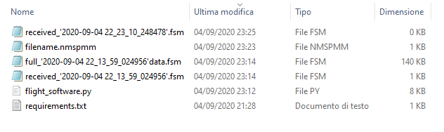

# Plot real-time/saved accelleration data from raspberry pi


## Install requirements on main machine:

Works on ```Python 3.7.9``` or later

```python
pip install -r requirements.txt
```
The [main.py](https://github.com/MrSinho/SpaceProgramm/blob/master/main.py) script will run on the main machine

## Install requirements for raspberry pi
 - Go here to setup the ADXL345 with the raspberry pi [Adafruit_Python_ADXL345](https://github.com/adafruit/Adafruit_Python_ADXL345)

 - Also some useful guides: [PiddlerInTheRoot](https://www.youtube.com/watch?v=NPTK0inTldw&t=428s), [Pi My Life Up](https://www.youtube.com/watch?v=QH1umP-duik&t=104s)

The [raspberry.py](https://github.com/MrSinho/SpaceProgramm/blob/master/main.py) script of [this](https://github.com/MrSinho/SpaceProgramm) repository will run on the raspberry

## Live Data:
- Edit the [raspberry.py](https://github.com/MrSinho/SpaceProgramm/blob/master/main.py) script and change the host address to the raspberry host address.

```python
s = socket.socket()
host = "192.168.1." # <-- Edit this
print(host)
port = 8080
```

- Run the [raspberry.py](https://github.com/MrSinho/SpaceProgramm/blob/master/main.py) script on your raspberry and the [main.py](https://github.com/MrSinho/SpaceProgramm/blob/master/main.py) on your pc.

- From your pc choose one from theese two options: we want a live simulation, so type 1. Then type the host address of your raspberry pi

```python
Choose what to do:
[1]: Live Simulation
[2]: Load Simulation
>>> 1
```
```python
 Insert the host address of the server
 >>> 192.168.1.
```
As you can see, now it's all working. Your main machine is plotting data from your sensor.


## Load Saved Data
If you check the directory of the [main.py](https://github.com/MrSinho/SpaceProgramm/blob/master/main.py), you'll find some files with the prefix ```full_``` and the extension ```.fsm```. These are the previous simulations that the main program automatically has saved: 



- Run the [main.py](https://github.com/MrSinho/SpaceProgramm/blob/master/main.py) file: this time choose the second option.

```python
Choose what to do:
[1]: Live Simulation
[2]: Load Simulation
>>> 2
```

- Enter the filename of the stored simulation you want to load: 

```python
Write the filename of the saved simulation:
>>> full_'2020-09-04 22_13_59_024956'data.fsm
```

- Scale the 3d graph by typing a scale value.

```python
Insert the scale value, type 1 to keep as default.
>>> 25
```

Done. Now you can load the previous simulations with high performance.


