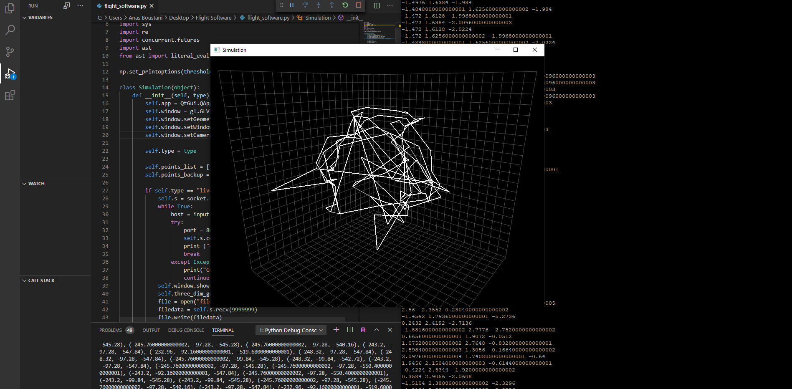
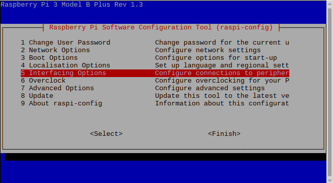
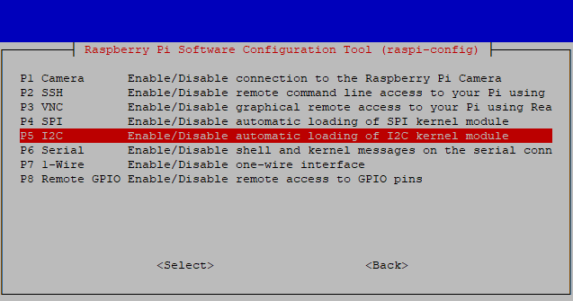
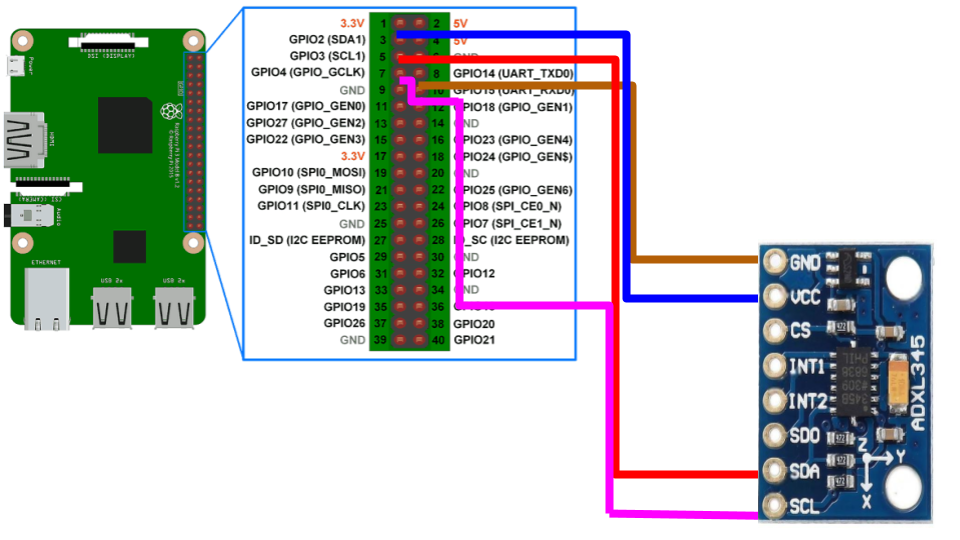

# Plot real time accelleration data from raspberry pi



## Install requirements on main machine:

Works on ```Python 3.7.9```

```python
pip install -r requirements.txt
```
the [flight_software.py](https://github.com/MrSinho/SpaceProgramm/blob/master/flight_software.py) script will run on the main machine

## Install requirements for raspberry pi
```python
sudo raspi-config
```
Select "Interfacing Options", "i2c" and enable

 

## Connect the ADXL345 sensor to your raspberry



restart ```sudo reboot```
type ```sudo i2c detect -y 1```, your sensor should be in the grid as number 53
clone the [Adafruit_Python_ADXL345](https://github.com/adafruit/Adafruit_Python_ADXL345) repository and run the setup script:
```python
git clone https://github.com/adafruit/Adafruit_Python_ADXL345.git
cd Adafruit_Python_ADXL345
sudo python setup.py install
```
the [raspberry.py](https://github.com/MrSinho/SpaceProgramm/blob/master/flight_software.py) script will run on the raspberry
