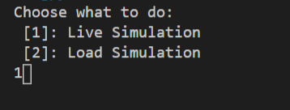
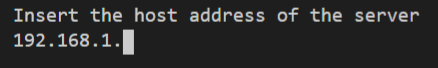
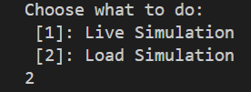
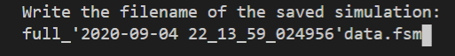
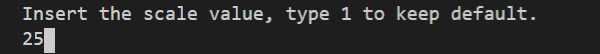

# Plot real-time/saved accelleration data from raspberry pi


## Install requirements on main machine:

Works on ```Python 3.7.9```

```python
pip install -r requirements.txt
```
the [flight_software.py](https://github.com/MrSinho/SpaceProgramm/blob/master/flight_software.py) script will run on the main machine

## Install requirements for raspberry pi
```python
sudo raspi-config
```
Select "Interfacing Options", "i2c" and enable

 

## Connect the ADXL345 sensor to your raspberry


restart ```sudo reboot```
type ```sudo i2c detect -y 1```, your sensor should be in the grid as number 53
clone the [Adafruit_Python_ADXL345](https://github.com/adafruit/Adafruit_Python_ADXL345) repository and run the setup script:
```python
git clone https://github.com/adafruit/Adafruit_Python_ADXL345.git
cd Adafruit_Python_ADXL345
sudo python setup.py install
```
the [raspberry.py](https://github.com/MrSinho/SpaceProgramm/blob/master/flight_software.py) script will run on the raspberry

## Live Data:
Edit the [raspberry.py](https://github.com/MrSinho/SpaceProgramm/blob/master/flight_software.py) script and change the host address to the raspberry host address.


Run the [raspberry.py](https://github.com/MrSinho/SpaceProgramm/blob/master/flight_software.py) script on your raspberry and the [flight_software.py](https://github.com/MrSinho/SpaceProgramm/blob/master/flight_software.py) on your pc.

From your pc choose one of the two options: we want a live simulation, so type 1. Then type the host address of your raspberry pi

 

As you can see, now it's all working. Your main machine is plotting data from your sensor.


## Load Saved Data
If you check the directory of the [flight_software.py](https://github.com/MrSinho/SpaceProgramm/blob/master/flight_software.py), you'll find some files, where the pc has saved the previous simulations, which have the prefix ```full_``` and the extension ```.fsm``` : 


Run the [flight_software.py](https://github.com/MrSinho/SpaceProgramm/blob/master/flight_software.py) file: this time choose the second option.



Enter the filename of the stored simulation you want to load: 



Scale the 3d graph by typing a scale value.



Done. Now you can see the previous simulations with high performance.


